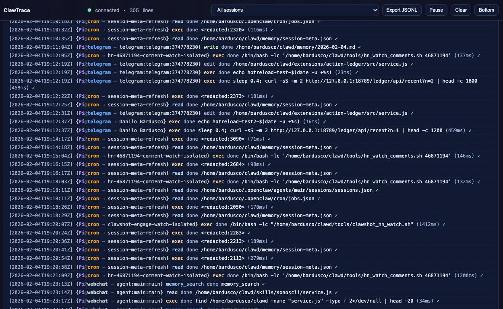

# ClawTrace

**Real-time action audit dashboard for OpenClaw**

ClawTrace captures every tool call your AI agent makes and displays them in a live, filterable dashboard. Perfect for monitoring, debugging, and understanding what your agent is doing.



## Features

- 🔴 **Live streaming** — SSE-powered real-time updates
- 🔍 **Smart filtering** — by tool, session, channel, or free text
- 🔒 **Auto-redaction** — secrets, tokens, and long strings are automatically sanitized
- 📊 **Session labels** — human-readable names instead of cryptic session IDs
- 🤖 **Auto agent name** — reads from `IDENTITY.md` automatically
- ⏱️ **Duration tracking** — see how long each tool call takes
- 📥 **Export** — download full JSONL ledger for analysis
- 🌙 **Dark theme** — easy on the eyes

## Installation

1. Copy the `clawtrace` folder to your OpenClaw extensions directory:
   ```bash
   cp -r clawtrace ~/.openclaw/extensions/
   ```

2. Enable the plugin in your OpenClaw config (`~/.openclaw/config.yaml`):
   ```yaml
   plugins:
     clawtrace:
       enabled: true
   ```

3. Restart OpenClaw:
   ```bash
   openclaw gateway restart
   ```

4. Open the dashboard at: `http://localhost:19099/ledger`

## Configuration

All settings are optional with sensible defaults:

| Option | Default | Description |
|--------|---------|-------------|
| `enabled` | `true` | Enable/disable the plugin |
| `bind` | `127.0.0.1` | Bind address for HTTP server |
| `port` | `19099` | HTTP port (uses gateway port if not set) |
| `pathPrefix` | `/ledger` | URL path prefix |
| `ledgerPath` | `<workspace>/memory/clawtrace.jsonl` | Where to store the ledger |
| `maxString` | `160` | Max string length before redaction |
| `dropKeysRegex` | `(token\|secret\|password\|...)` | Keys to always redact |
| `enableNotes` | `true` | Allow adding manual notes via API |
| `agentName` | *(from IDENTITY.md)* | Override agent display name |

## API Endpoints

| Endpoint | Method | Description |
|----------|--------|-------------|
| `/ledger` | GET | Dashboard UI |
| `/ledger/events` | GET | SSE live stream |
| `/ledger/api/recent?n=200` | GET | Last N entries as JSON |
| `/ledger/api/export` | GET | Download full JSONL |
| `/ledger/api/note` | POST | Add a manual note |

## Ledger Format

Each line in the JSONL ledger:

```json
{
  "ts": "2025-02-04T19:00:00Z",
  "source": "plugin",
  "agent": { "id": "main", "name": "Pi" },
  "session": { "key": "agent:main:main", "id": "...", "label": "Danilo", "channel": "telegram" },
  "tool": "exec",
  "phase": "done",
  "summary": "ls -la",
  "details": { "durationMs": 42, "result": "ok" }
}
```

## Privacy & Security

- All secrets are auto-redacted before logging
- Runs on localhost by default (not exposed to internet)
- No data leaves your machine

## License

MIT
